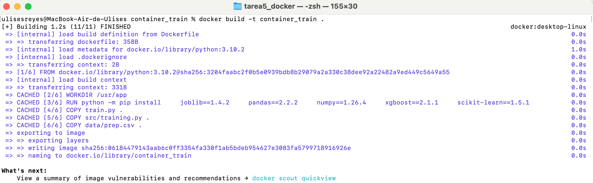
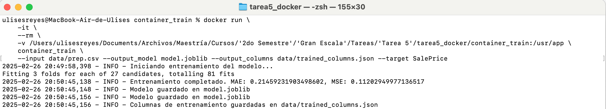

.. trainer documentation master file, created by
   sphinx-quickstart on Wed Feb 26 17:05:43 2025.
   You can adapt this file completely to your liking, but it should at least
   contain the root `toctree` directive.

Documentación del Componente 'Trainer'
=====================

El componente 'Trainer' nos ayuda a generar un modelo de ML 
basado en un XGBoost para predecir el precio de casas dado 
un conjunto de características en particular.

.. toctree::
   :maxdepth: 2
   :caption: Contenido

   modules

Instrucciones
=============

Clonar repositorio
------------------
Primero, es necesario clonar el repositorio:

.. code-block:: bash

    git clone git@github.com:UlisesRG-ITAM/tarea5_docker.git

Ir a carpeta con Dockerfile
------------------
Acceder a la siguiente carpeta:

.. code-block:: bash

    cd container_train

Construir la imagen
-------------------
Después de clonar el repositorio, construye la imagen:

.. code-block:: bash

    docker build -t container_train .

Correr el contenedor
--------------------
Finalmente, corre el contenedor con las siguientes instrucciones:

.. code-block:: bash

    docker run \
        -it \
        --rm \
        -v <ubicacion_donde_se_clono_el_repo>/tarea5_docker/container_train:/usr/app \
        container_train \
        --input data/prep.csv --output_model model.joblib --output_columns data/trained_columns.json --target SalePrice

Ejemplo de ejecución
====================

Construcción de la imagen:

Ejecución del contenedor:

